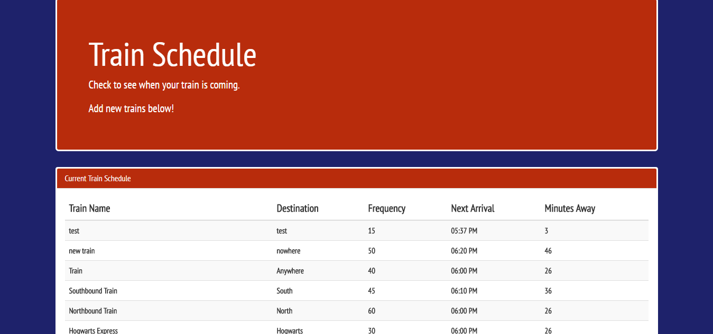

# Train_Scheduler

This application displays train train times inputted by the user. 

The train times are stored in a Google Firebase database and then are displayed on the HTML page. 

There is a form at the bottom of the page where the user can enter in a new train. That train is then added to this list and the user is show how much time they are until that train arrives. 

## Languages Used

This application uses HTML, CSS, Bootstrap, JavaScript, JQuery, MomentJS, and Firebase.

